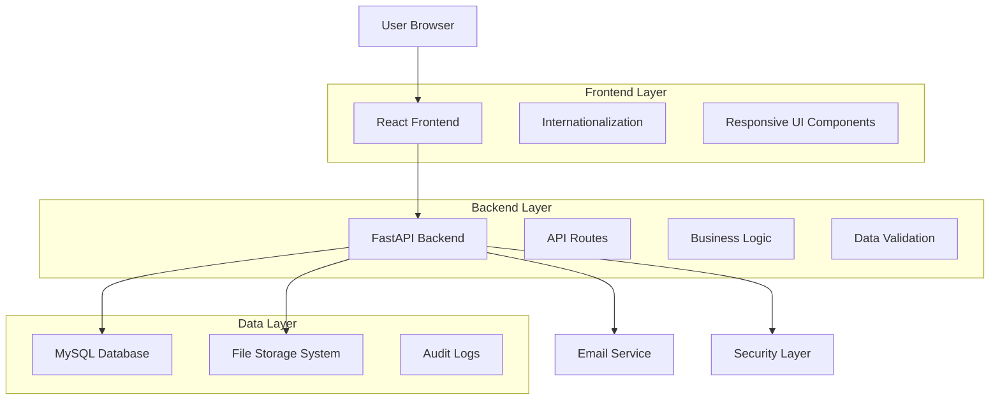

# FormVault Insurance Portal - Design Document

## Overview

FormVault is designed as a modern, secure web application using a clean separation between frontend and backend components. The architecture follows RESTful API principles with a React-based frontend communicating with a FastAPI backend, supported by MySQL for data persistence and integrated email services for automated document export.

## Architecture

### High-Level Architecture



### Technology Stack

**Frontend:**
- React 18+ with TypeScript for type safety
- Material-UI or Tailwind CSS for responsive design
- React Hook Form for form management and validation
- React-i18next for internationalization
- Axios for API communication

**Backend:**
- FastAPI with Python 3.9+ for high-performance API development
- Pydantic for data validation and serialization
- SQLAlchemy ORM for database operations
- Alembic for database migrations
- Python-multipart for file upload handling

**Database & Storage:**
- MySQL 8.0+ for relational data storage
- Local file system with secure directory structure for document storage
- Redis (optional) for session management and caching

**Infrastructure:**
- SMTP service for email delivery (configurable provider)
- SSL/TLS encryption for all communications
- Environment-based configuration management

## Components and Interfaces

### Frontend Components

#### 1. Application Form Component
```typescript
interface PersonalInfoForm {
  firstName: string;
  lastName: string;
  email: string;
  phone: string;
  address: Address;
  dateOfBirth: Date;
  insuranceType: InsuranceType;
}

interface Address {
  street: string;
  city: string;
  state: string;
  zipCode: string;
  country: string;
}
```

#### 2. File Upload Component
```typescript
interface FileUploadProps {
  fileType: 'student_id' | 'passport';
  maxSize: number; // 5MB
  acceptedFormats: string[]; // ['image/jpeg', 'image/png', 'application/pdf']
  onUploadSuccess: (fileInfo: UploadedFile) => void;
  onUploadError: (error: string) => void;
}

interface UploadedFile {
  id: string;
  originalName: string;
  size: number;
  mimeType: string;
  uploadedAt: Date;
}
```

#### 3. Language Selector Component
```typescript
interface LanguageConfig {
  code: string; // 'en', 'zh', 'es'
  name: string;
  flag: string;
}
```

### Backend API Interfaces

#### 1. Application Submission Endpoint
```python
# POST /api/applications
class ApplicationCreate(BaseModel):
    personal_info: PersonalInfo
    student_id_file: Optional[str]  # File ID from upload
    passport_file: Optional[str]    # File ID from upload
    preferred_language: str = "en"

class ApplicationResponse(BaseModel):
    application_id: str
    reference_number: str
    status: ApplicationStatus
    created_at: datetime
```

#### 2. File Upload Endpoint
```python
# POST /api/files/upload
class FileUploadResponse(BaseModel):
    file_id: str
    original_filename: str
    file_size: int
    mime_type: str
    upload_url: str  # For preview/download
```

#### 3. Email Export Endpoint
```python
# POST /api/applications/{application_id}/export
class EmailExportRequest(BaseModel):
    recipient_email: str
    insurance_company: str
    additional_notes: Optional[str]

class EmailExportResponse(BaseModel):
    export_id: str
    status: ExportStatus
    sent_at: Optional[datetime]
```

## Data Models

### Database Schema

#### Applications Table
```sql
CREATE TABLE applications (
    id VARCHAR(36) PRIMARY KEY,
    reference_number VARCHAR(20) UNIQUE NOT NULL,
    first_name VARCHAR(100) NOT NULL,
    last_name VARCHAR(100) NOT NULL,
    email VARCHAR(255) NOT NULL,
    phone VARCHAR(20),
    address_street VARCHAR(255),
    address_city VARCHAR(100),
    address_state VARCHAR(100),
    address_zip_code VARCHAR(20),
    address_country VARCHAR(100),
    date_of_birth DATE,
    insurance_type ENUM('health', 'auto', 'life', 'travel') NOT NULL,
    preferred_language VARCHAR(5) DEFAULT 'en',
    status ENUM('draft', 'submitted', 'exported', 'processed') DEFAULT 'draft',
    created_at TIMESTAMP DEFAULT CURRENT_TIMESTAMP,
    updated_at TIMESTAMP DEFAULT CURRENT_TIMESTAMP ON UPDATE CURRENT_TIMESTAMP,
    INDEX idx_reference_number (reference_number),
    INDEX idx_email (email),
    INDEX idx_created_at (created_at)
);
```

#### Files Table
```sql
CREATE TABLE files (
    id VARCHAR(36) PRIMARY KEY,
    application_id VARCHAR(36),
    file_type ENUM('student_id', 'passport') NOT NULL,
    original_filename VARCHAR(255) NOT NULL,
    stored_filename VARCHAR(255) NOT NULL,
    file_size INT NOT NULL,
    mime_type VARCHAR(100) NOT NULL,
    file_hash VARCHAR(64), -- SHA-256 for integrity
    upload_ip VARCHAR(45),
    created_at TIMESTAMP DEFAULT CURRENT_TIMESTAMP,
    FOREIGN KEY (application_id) REFERENCES applications(id) ON DELETE CASCADE,
    INDEX idx_application_id (application_id)
);
```

#### Email Exports Table
```sql
CREATE TABLE email_exports (
    id VARCHAR(36) PRIMARY KEY,
    application_id VARCHAR(36) NOT NULL,
    recipient_email VARCHAR(255) NOT NULL,
    insurance_company VARCHAR(255),
    status ENUM('pending', 'sent', 'failed', 'retry') DEFAULT 'pending',
    sent_at TIMESTAMP NULL,
    error_message TEXT,
    retry_count INT DEFAULT 0,
    created_at TIMESTAMP DEFAULT CURRENT_TIMESTAMP,
    FOREIGN KEY (application_id) REFERENCES applications(id) ON DELETE CASCADE,
    INDEX idx_application_id (application_id),
    INDEX idx_status (status)
);
```

#### Audit Logs Table
```sql
CREATE TABLE audit_logs (
    id BIGINT AUTO_INCREMENT PRIMARY KEY,
    application_id VARCHAR(36),
    action VARCHAR(100) NOT NULL,
    user_ip VARCHAR(45),
    user_agent TEXT,
    details JSON,
    created_at TIMESTAMP DEFAULT CURRENT_TIMESTAMP,
    INDEX idx_application_id (application_id),
    INDEX idx_action (action),
    INDEX idx_created_at (created_at)
);
```

## Error Handling

### Frontend Error Handling
- **Form Validation Errors**: Real-time validation with field-specific error messages
- **Network Errors**: Retry mechanisms with exponential backoff
- **File Upload Errors**: Clear messaging for size, format, and network issues
- **Global Error Boundary**: Catch and display unexpected React errors

### Backend Error Handling
```python
class FormVaultException(Exception):
    def __init__(self, message: str, error_code: str, status_code: int = 400):
        self.message = message
        self.error_code = error_code
        self.status_code = status_code

# Custom exception handlers
@app.exception_handler(FormVaultException)
async def formvault_exception_handler(request: Request, exc: FormVaultException):
    return JSONResponse(
        status_code=exc.status_code,
        content={
            "error": {
                "message": exc.message,
                "code": exc.error_code,
                "timestamp": datetime.utcnow().isoformat()
            }
        }
    )
```

### Error Categories
- **Validation Errors** (400): Invalid input data, file format issues
- **Authentication Errors** (401): Invalid session or access tokens
- **Authorization Errors** (403): Insufficient permissions
- **Not Found Errors** (404): Application or file not found
- **Server Errors** (500): Database connection, email service failures

## Testing Strategy

### Frontend Testing
- **Unit Tests**: Jest + React Testing Library for component testing
- **Integration Tests**: API integration testing with mock backend
- **E2E Tests**: Cypress for complete user journey testing
- **Accessibility Tests**: axe-core for WCAG compliance
- **Visual Regression Tests**: Chromatic or similar for UI consistency

### Backend Testing
- **Unit Tests**: pytest for individual function testing
- **Integration Tests**: TestClient for API endpoint testing
- **Database Tests**: Test database with fixtures for data layer testing
- **Security Tests**: SQL injection, XSS, and file upload security testing
- **Performance Tests**: Load testing for file uploads and form submissions

### Test Data Management
```python
# Test fixtures for consistent testing
@pytest.fixture
def sample_application():
    return {
        "first_name": "John",
        "last_name": "Doe",
        "email": "john.doe@example.com",
        "phone": "+1234567890",
        "address": {
            "street": "123 Main St",
            "city": "Anytown",
            "state": "CA",
            "zip_code": "12345",
            "country": "USA"
        },
        "date_of_birth": "1990-01-01",
        "insurance_type": "health",
        "preferred_language": "en"
    }
```

### Security Testing
- **File Upload Security**: Malware scanning, file type validation
- **Input Sanitization**: SQL injection and XSS prevention testing
- **Data Encryption**: Verify sensitive data encryption at rest and in transit
- **Session Security**: Test session timeout and secure cookie handling
- **Rate Limiting**: Test API rate limiting and abuse prevention

### Performance Testing
- **Load Testing**: Simulate concurrent user submissions
- **File Upload Performance**: Test large file uploads and concurrent uploads
- **Database Performance**: Query optimization and connection pooling
- **Email Service Performance**: Test bulk email sending capabilities

This design provides a robust, scalable foundation for FormVault that addresses all the requirements while maintaining security, performance, and user experience standards.