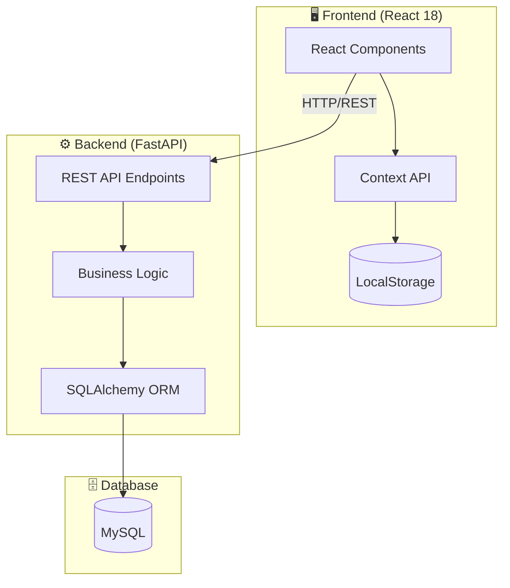

# 🛡️ FormVault

[](https://github.com/yuanweize/FormVault/actions/workflows/frontend-ci.yml)
[](https://github.com/yuanweize/FormVault/actions/workflows/backend-ci.yml)
[](https://opensource.org/licenses/MIT)
[](https://www.typescriptlang.org/)
[](https://reactjs.org/)
[](https://www.python.org/)
[](https://eslint.org/)

> **[中文文档 (Chinese Version)](README_zh.md)**

**FormVault** is a secure, modern multi-step application workflow system designed for complex form submissions, document uploads, and validation processes.

---

## ✨ Key Features

- **🔄 Multi-Step Workflow** — Intuitive stepper navigation for complex data entry
- **📁 Secure File Uploads** — ID cards, passports, and document validation with type checking
- **✅ Real-time Validation** — Robust form validation using `react-hook-form` and Zod schemas
- **💾 State Persistence** — Automatically saves progress to LocalStorage
- **📱 Responsive Design** — Built with Material UI for seamless mobile/desktop UX
- **♿ Accessibility** — WCAG compliant with comprehensive ARIA support
- **🌍 Internationalization** — Multi-language support (i18n)

---

## 🏗️ System Architecture



---

## 📁 Project Structure

```
FormVault/
├── frontend/
│   └── src/
│       ├── components/      # Reusable UI components
│       │   ├── common/      # Shared components (Header, Footer, etc.)
│       │   └── forms/       # Form-specific components
│       ├── pages/           # Route-level page components
│       ├── hooks/           # Custom React hooks
│       ├── contexts/        # React Context providers
│       ├── services/        # API client services
│       ├── i18n/            # Internationalization config
│       └── types/           # TypeScript type definitions
│
├── backend/
│   └── app/
│       ├── api/             # FastAPI route handlers
│       │   └── v1/endpoints/
│       ├── core/            # Configuration & exceptions
│       ├── models/          # SQLAlchemy ORM models
│       ├── schemas/         # Pydantic request/response schemas
│       ├── services/        # Business logic layer
│       ├── middleware/      # Request middleware
│       └── utils/           # Helper utilities
│
└── .github/workflows/       # CI/CD pipelines
    ├── frontend-ci.yml
    └── backend-ci.yml
```

---

## 🛠️ Tech Stack

| Layer | Technologies |
|-------|--------------|
| **Frontend** | React 18, TypeScript 5, Material UI v5, React Router v6 |
| **State** | Context API + useReducer, LocalStorage persistence |
| **Forms** | React Hook Form, Zod validation |
| **Backend** | FastAPI, Python 3.11+, Uvicorn |
| **Database** | SQLAlchemy ORM, MySQL, Alembic migrations |
| **Testing** | Jest, React Testing Library, pytest |
| **Quality** | ESLint 9 (Flat Config), Mypy (strict for core modules), Black |

---

## 🚀 Getting Started

### Prerequisites

- Node.js v18+
- Python 3.11+
- MySQL 8.0+

### Installation

```bash
# Clone the repository
git clone https://github.com/yuanweize/FormVault.git
cd FormVault

# Frontend setup
cd frontend
npm install
npm start

# Backend setup (in another terminal)
cd backend
pip install -r requirements.txt
uvicorn app.main:app --reload

# 3. Setup Admin Account
# Open your browser and visit:
# http://localhost:8000/setup
```

---

## ☁️ Deployment

### One-Click Deploy

Deploy the full stack with a single click:

[](https://render.com/deploy?repo=https://github.com/yuanweize/FormVault)

[](https://vercel.com/new/clone?repository-url=https://github.com/yuanweize/FormVault)

[](https://railway.app/new/template?template=https://github.com/yuanweize/FormVault)

[](https://app.netlify.com/start/deploy?repository=https://github.com/yuanweize/FormVault)

> [!IMPORTANT]
> **Manual connection required!** After deployment, you must manually set the frontend's `REACT_APP_API_BASE_URL` to point to your backend. See steps below.

### 📋 Recommended Deployment Order

> [!TIP]
> **Deploy backend first, then frontend.** This ensures your API URL is ready when configuring the frontend.

#### Step 1: Deploy Backend (Render/Railway)
1. Click the **Render** or **Railway** button above
2. Wait for the build to complete (~5 minutes)
3. Copy your Backend URL (e.g., `https://formvault-api.onrender.com`)

#### Step 2: Deploy Frontend (Vercel/Netlify)
1. Click the **Vercel** or **Netlify** button above
2. When prompted for Environment Variables, add:
   - `REACT_APP_API_BASE_URL` = `https://formvault-api.onrender.com` (your backend URL from Step 1)
3. Click Deploy

#### Step 3: Link Frontend to Backend (Critical!)
> If you missed Step 2, or deployed without env vars:
1. Go to your Frontend dashboard (Vercel/Netlify)
2. Navigate to **Settings** → **Environment Variables**
3. Add: `REACT_APP_API_BASE_URL` = `https://your-backend-url.onrender.com`
4. **Trigger a Redeploy** (required for changes to take effect)

#### Step 4: Configure CORS on Backend
1. Go to your Backend dashboard (Render/Railway)
2. Add/Update the environment variable:
   - `CORS_ORIGINS` = `https://formvault-frontend.onrender.com` (your frontend URL)

### Deployment Options

| Platform | Type | What's Deployed |
|----------|------|-----------------|
| **Render** | Full Stack | Backend API + Frontend + PostgreSQL Database |
| **Vercel** | Frontend Only | React app (configure API URL separately) |
| **Railway** | Full Stack | Backend + Frontend + Database |
| **Netlify** | Frontend Only | React app (static hosting with Functions support) |

### Environment Variables

| Variable | Required | Source | Description |
|----------|----------|--------|-------------|
| `SECRET_KEY` | Yes | 🔄 Auto (Render) / 🔧 Manual | JWT signing key for authentication |
| `DATABASE_URL` | Yes | 🔄 Auto (Render/Railway) | PostgreSQL connection string |
| `CORS_ORIGINS` | Yes | 🔧 Manual | Frontend URL for CORS (e.g., `https://yourapp.vercel.app`) |
| `REACT_APP_API_BASE_URL` | Yes | 🔧 Manual | Backend API base URL (e.g., `https://api.yourapp.com`) |

**Legend:**
- 🔄 Auto — Automatically provided by the platform
- 🔧 Manual — You must configure this manually

---

## ⚙️ Configuration & Admin

### 🧙‍♂️ First-Run Setup
This application features a **Setup Wizard** to create your initial Administrator account.
- **URL**: `/setup` (e.g., `https://your-api.com/setup`)
- **Action**: Create your username and secure password.

### 🔑  Admin Dashboard
Access the **No-Code Admin Panel** at `/admin` to:
- **Manage Data**: View, edit, and delete applications and files.
- **Configure System**: Use the **System Configuration** view to switch between Local and S3 storage dynamically.
- **S3 Support**: Compatible with AWS S3, Oracle Cloud, and others. Simply enter your keys in the UI—no restart required.

---

## 🧪 Testing & Quality

### Frontend
```bash
cd frontend
npm run lint      # ESLint 9 with Flat Config
npm test          # Jest + React Testing Library
npm run build     # Production build check
```

### Backend
```bash
cd backend
flake8 .          # Linting
black --check .   # Format check
mypy .            # Type checking (strict for core/schemas)
pytest            # Unit & integration tests
```

---

## 🔒 Quality Assurance

| Tool | Purpose | Scope |
|------|---------|-------|
| **ESLint 9** | Linting | Frontend (Flat Config) |
| **Mypy** | Type checking | Backend (strict for `app.core`, `app.schemas`) |
| **Black** | Formatting | Backend |
| **Jest** | Unit tests | Frontend components |
| **pytest** | Tests | Backend API & services |
| **Dual CI** | Automation | Separate pipelines for frontend/backend |

---

## 📄 License

MIT License — see [LICENSE](LICENSE) for details.

## 🤝 Contributing

Contributions welcome! Please read [CONTRIBUTING.md](CONTRIBUTING.md) before submitting PRs.