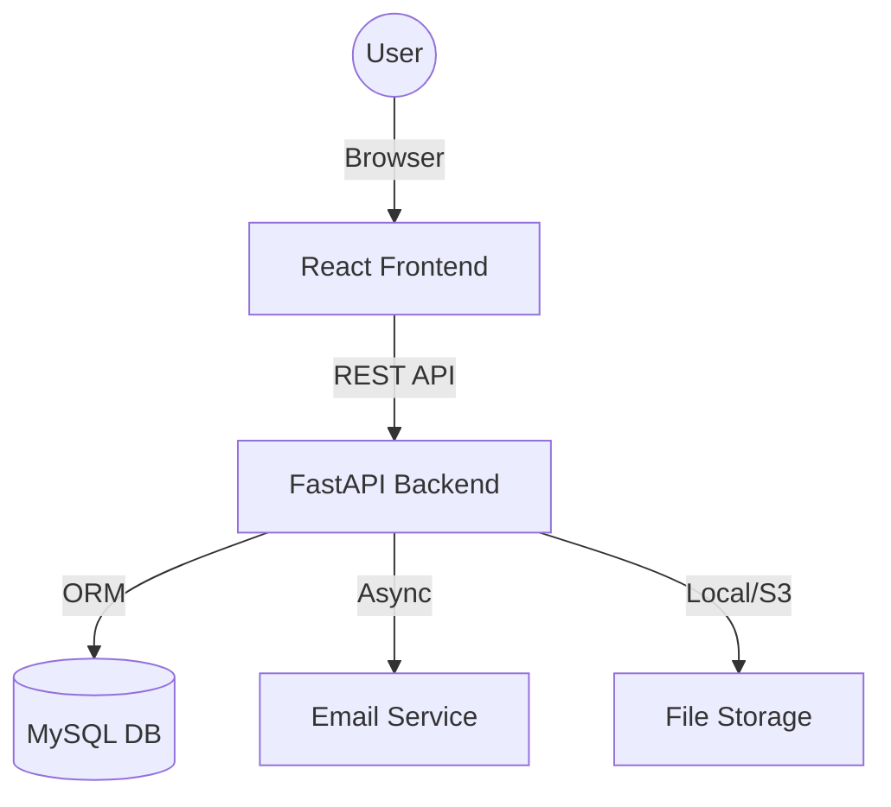

# FormVault Insurance Portal

[](https://github.com/yuanweize/FormVault/actions)
[](https://github.com/yuanweize/FormVault/actions)
[](https://opensource.org/licenses/MIT)

一个安全的多语言保险申请门户，使用 React 和 FastAPI 构建。

## 🏗️ 系统架构



## ✨ 功能特性

- 🔐 **安全认证**: 基于 JWT 的用户认证和授权。
- 🌍 **全球化**: 多语言支持（中文、英文、西班牙语）。
- 📁 **文档管理**: 高性能文件上传与加密存储。
- 📧 **自动化分发**: 自动将申请书导出并发送给保险公司。
- 👨‍💼 **管理后台**: 全面的审计日志与申请管理仪表板。
- 🚀 **生产就绪**: 完整的 Docker Compose 部署方案与 CI 流水线。

## 技术栈

### 前端
- React 18 + TypeScript
- Material-UI (MUI) 组件库
- React Router 路由管理
- React Hook Form 表单处理
- i18next 国际化
- Axios API 通信

### 后端
- FastAPI + Python 3.11+
- SQLAlchemy ORM + MySQL
- Pydantic 数据验证
- JWT 身份认证
- 邮件服务集成
- 文件存储管理
- 完整的日志和监控

## 快速开始

### 环境要求
- Node.js 18+
- Python 3.11+
- MySQL 8.0+
- Docker 和 Docker Compose（容器化部署）

### 开发环境设置

1. 克隆仓库：
```bash
git clone https://github.com/your-username/FormVault.git
cd FormVault
```

2. 设置后端：
```bash
cd backend
python -m venv venv
source venv/bin/activate  # Windows: venv\Scripts\activate
pip install -r requirements.txt
```

3. 设置前端：
```bash
cd frontend
npm install
```

4. 配置环境变量：
```bash
# 后端
cp backend/.env.template backend/.env
# 编辑 backend/.env 配置文件

# 前端
cp frontend/.env.template frontend/.env
# 编辑 frontend/.env 配置文件
```

5. 运行数据库迁移：
```bash
cd backend
alembic upgrade head
```

6. 启动开发服务器：
```bash
# 后端（在 backend 目录下）
uvicorn app.main:app --reload

# 前端（在 frontend 目录下）
npm start
```

访问应用：
- 前端：http://localhost:3000
- 后端 API：http://localhost:8000
- API 文档：http://localhost:8000/docs

## 生产部署

### 使用 Docker Compose

1. 配置生产环境变量：
```bash
cp backend/.env.template backend/.env.production
cp frontend/.env.template frontend/.env.production
# 编辑 .env.production 文件设置生产环境配置
```

2. 使用 Docker Compose 部署：
```bash
docker-compose -f docker-compose.prod.yml up -d
```

## API 文档

后端运行后，访问：
- Swagger UI: `http://localhost:8000/docs`
- ReDoc: `http://localhost:8000/redoc`

## 测试

### 后端测试
```bash
cd backend
pytest
```

### 前端测试
```bash
cd frontend
npm test
```

### 端到端测试
```bash
cd frontend
npm run cypress:run
```

## 项目结构

```
FormVault/
├── backend/                 # FastAPI 后端
│   ├── app/
│   │   ├── api/            # API 路由
│   │   ├── core/           # 核心配置
│   │   ├── models/         # 数据模型
│   │   ├── services/       # 业务逻辑
│   │   ├── middleware/     # 中间件
│   │   └── utils/          # 工具函数
│   ├── tests/              # 测试文件
│   ├── alembic/            # 数据库迁移
│   └── requirements.txt    # Python 依赖
├── frontend/               # React 前端
│   ├── src/
│   │   ├── components/     # React 组件
│   │   ├── pages/          # 页面组件
│   │   ├── services/       # API 服务
│   │   ├── hooks/          # 自定义 Hooks
│   │   ├── i18n/           # 国际化配置
│   │   └── contexts/       # React Context
│   ├── public/             # 静态资源
│   └── package.json        # Node.js 依赖
└── docker-compose.prod.yml # 生产环境 Docker 配置
```

## 主要功能

### 用户功能
- 多步骤表单填写
- 文件上传（支持拖拽）
- 实时表单验证
- 多语言界面切换
- 移动端友好设计

### 管理功能
- 申请管理仪表板
- 用户数据导出
- 系统监控和日志
- 审计跟踪

### 安全特性
- JWT 身份认证
- 数据加密传输
- 文件类型验证
- 速率限制
- CORS 保护

## 贡献指南

1. Fork 本仓库
2. 创建功能分支 (`git checkout -b feature/AmazingFeature`)
3. 提交更改 (`git commit -m 'Add some AmazingFeature'`)
4. 推送到分支 (`git push origin feature/AmazingFeature`)
5. 开启 Pull Request

## 许可证

本项目采用 MIT 许可证 - 查看 [LICENSE](LICENSE) 文件了解详情。

## 支持

如有问题或需要支持，请在 GitHub 仓库中创建 issue。

---

**FormVault** - 让保险申请更简单、更安全 🚀