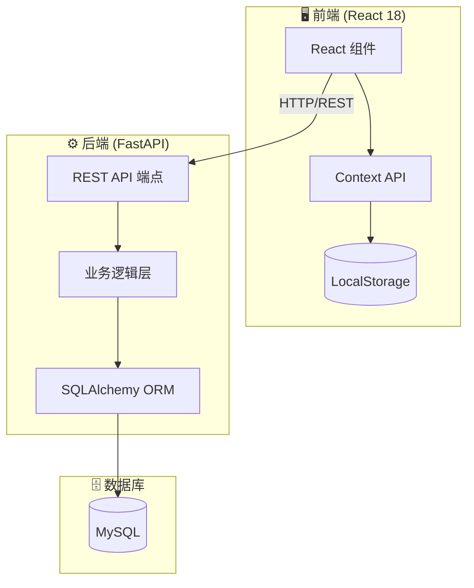

# 🛡️ FormVault

[](https://github.com/yuanweize/FormVault/actions/workflows/frontend-ci.yml)
[](https://github.com/yuanweize/FormVault/actions/workflows/backend-ci.yml)
[](https://opensource.org/licenses/MIT)
[](https://www.typescriptlang.org/)
[](https://reactjs.org/)
[](https://www.python.org/)
[](https://eslint.org/)

> **[English Version](README.md)**

**FormVault** 是一个安全、现代的多步骤申请工作流系统，专为复杂表单提交、文档上传和验证流程设计。

---

## ✨ 核心特性

- **🔄 多步骤工作流** — 直观的步骤导航，适用于复杂数据录入
- **📁 安全文件上传** — 支持身份证、护照等文档验证及类型检查
- **✅ 实时表单验证** — 使用 `react-hook-form` 和 Zod 模式进行稳健验证
- **💾 状态持久化** — 自动保存进度到 LocalStorage，防止数据丢失
- **📱 响应式设计** — 使用 Material UI 构建，移动端/桌面端体验一致
- **♿ 无障碍访问** — 符合 WCAG 标准，提供完整 ARIA 支持
- **🌍 国际化** — 多语言支持 (i18n)

---

## 🏗️ 系统架构



---

## 📁 项目结构

```
FormVault/
├── frontend/
│   └── src/
│       ├── components/      # 可复用 UI 组件
│       │   ├── common/      # 公共组件 (页头、页脚等)
│       │   └── forms/       # 表单专用组件
│       ├── pages/           # 路由级页面组件
│       ├── hooks/           # 自定义 React Hooks
│       ├── contexts/        # React Context 提供者
│       ├── services/        # API 客户端服务
│       ├── i18n/            # 国际化配置
│       └── types/           # TypeScript 类型定义
│
├── backend/
│   └── app/
│       ├── api/             # FastAPI 路由处理器
│       │   └── v1/endpoints/
│       ├── core/            # 配置与异常处理
│       ├── models/          # SQLAlchemy ORM 模型
│       ├── schemas/         # Pydantic 请求/响应模式
│       ├── services/        # 业务逻辑层
│       ├── middleware/      # 请求中间件
│       └── utils/           # 工具函数
│
└── .github/workflows/       # CI/CD 流水线
    ├── frontend-ci.yml
    └── backend-ci.yml
```

---

## 🛠️ 技术栈

| 层级 | 技术 |
|------|------|
| **前端** | React 18, TypeScript 5, Material UI v5, React Router v6 |
| **状态管理** | Context API + useReducer, LocalStorage 持久化 |
| **表单处理** | React Hook Form, Zod 验证 |
| **后端** | FastAPI, Python 3.11+, Uvicorn |
| **数据库** | SQLAlchemy ORM, MySQL, Alembic 迁移 |
| **测试** | Jest, React Testing Library, pytest |
| **代码质量** | ESLint 9 (Flat Config), Mypy (核心模块严格检查), Black |

---

## 🚀 快速开始

### 环境要求

- Node.js v18+
- Python 3.11+
- MySQL 8.0+

### 安装步骤

```bash
# 克隆仓库
git clone https://github.com/yuanweize/FormVault.git
cd FormVault

# 前端设置
cd frontend
npm install
npm start

# 后端设置（在另一个终端）
cd backend
pip install -r requirements.txt
uvicorn app.main:app --reload
```

---

## 🧪 测试与质量

### 前端
```bash
cd frontend
npm run lint      # ESLint 9 Flat Config 检查
npm test          # Jest + React Testing Library
npm run build     # 生产环境构建检查
```

### 后端
```bash
cd backend
flake8 .          # 代码检查
black --check .   # 格式检查
mypy .            # 类型检查（核心/模式模块严格模式）
pytest            # 单元与集成测试
```

---

## 🔒 质量保障

| 工具 | 用途 | 作用范围 |
|------|------|----------|
| **ESLint 9** | 代码检查 | 前端 (Flat Config) |
| **Mypy** | 类型检查 | 后端 (`app.core`, `app.schemas` 严格模式) |
| **Black** | 代码格式化 | 后端 |
| **Jest** | 单元测试 | 前端组件 |
| **pytest** | 测试 | 后端 API 与服务 |
| **双流水线 CI** | 自动化 | 前后端独立 CI 流水线 |

---

## 📄 许可证

MIT 许可证 — 详见 [LICENSE](LICENSE) 文件。

## 🤝 参与贡献

欢迎贡献！提交 PR 前请阅读 [CONTRIBUTING.md](CONTRIBUTING.md)。
