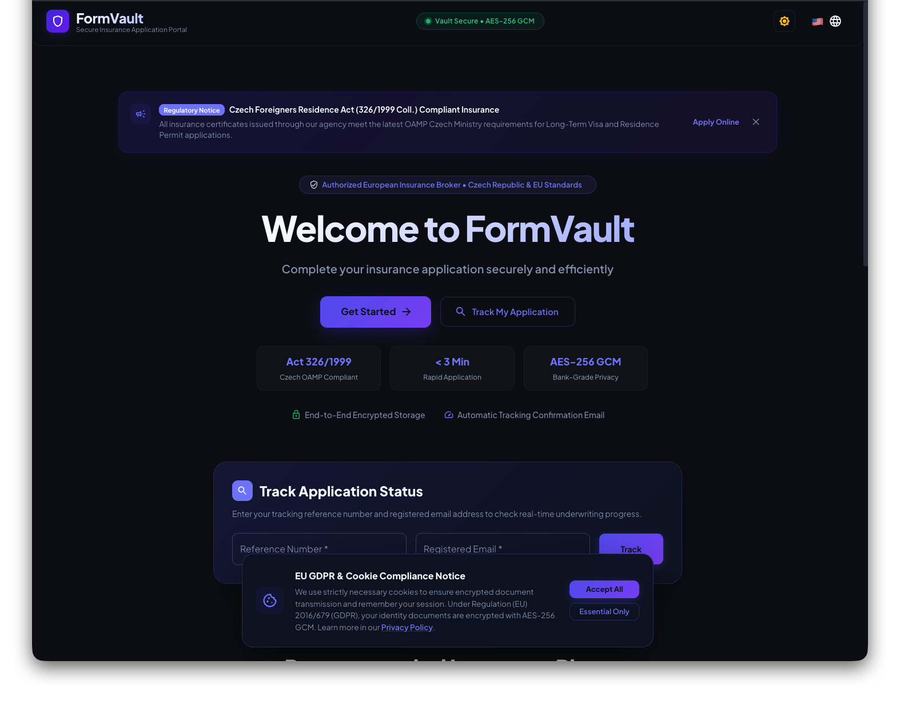
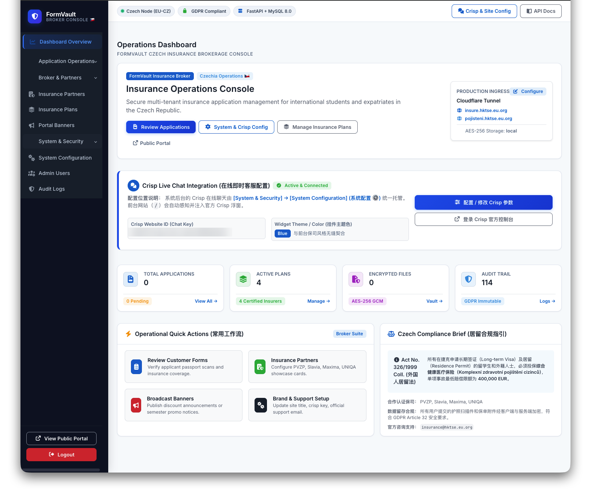

# FormVault

[](https://github.com/yuanweize/FormVault/actions/workflows/frontend-ci.yml)
[](https://github.com/yuanweize/FormVault/actions/workflows/backend-ci.yml)
[](LICENSE)
[](https://www.typescriptlang.org/)
[](https://reactjs.org/)
[](https://www.python.org/)
[](https://www.docker.com/)

> **[English Version](README.md)**
>
> 🌐 **在线演示 (Live Demo)**: [https://pojisteni.hktse.eu.org/](https://pojisteni.hktse.eu.org/)

**FormVault** 是一套企业级、可信优先（Trust-First）的现代保险科技（InsurTech）SaaS 平台，专为多步骤保单申报、高敏感身份（护照、学生证）加密上传、客户端验真、AES-256-GCM 文件加密存储与可审计邮件归档流转设计。

<div align="center">
  
  <p><em>FormVault 投保申请前端 — 多步骤保单申报、捷克主流保险产品即时算价、凭据校验与金融级安全护航轨</em></p>
</div>

---

## 核心特性与架构亮点

- **现代高奢 InsurTech SaaS 视觉体验** — 支持 Obsidian 深邃暗黑与 Alpine 极简纯白天体切换、毛玻璃卡片与聚焦微发光。
- **保险代理人通用产品展示与管理架构** — 预载捷克合规留学生与工作居留健康险真实样板（PVZP、Slavia、SV pojišťovna 等，CZK 计价，依托 České pojištění 合作网络），通用模型完全动态可配置，开源无硬编码。
- **首页双因子极简状态追踪与时间轴 (`/track`)** — 客户凭【申请编号 + 申请邮箱】即可在首页直接查询审核与承保出单进度时间轴，数据全程安全脱敏（OWASP 合规）。
- **自动申请回执与追踪邮件通知** — 提交即刻发送带有唯一追踪号的确认邮件，投保体验更安心。
- **专属金融安全护航面板 (`SecurityAssuranceRail`)** — 实时展示 TLS 1.3 安全通道状态、AES-256 GCM 硬件加密验证、Zero-Knowledge 隐私隔离。
- **Stripe 级流动发光步骤轨 (`WorkflowProgressIndicator`)** — 呼吸脉冲光环、祖母绿完成徽标、动态平滑进度条。
- **机密凭证安全文件库** — 客户端文件头签名严格校验、哈希验真脱敏预览、防篡改存储。
- **实时严谨校验** — 基于 `react-hook-form` 的流式校验与即时错误定位。
- **加密自动草稿暂存** — 智能防丢失保护，离线或刷新无缝恢复进度。
- **零外网暴露数据库架构** — MySQL 仅在内部专用隔离网络通信，杜绝外网撞库风险。
- **100% WCAG 无障碍访问** — axe 自动化零违规检测，全键盘与屏幕阅读器无障碍适配。
- **国际化多语言支持 (i18n)** — 英语、简体中文、西班牙语等丝滑无刷新切换。

<div align="center">
  
  <p><em>FormVault 代理人运营后台 — 投保申请全生命周期流转、审计归档追溯与加密凭证审核</em></p>
</div>

---

## Docker Compose 极简容器化部署（推荐）

FormVault 提供了开箱即用、具备**完整数据持久化**与**专属高位无冲突端口**的 `docker-compose.yml`，且默认直接从 **GHCR (GitHub Container Registry)** 自动拉取预打包镜像，无需在宿主机安装编译工具链。

### 1. 快速启动（一键秒级部署）

```bash
# 1. 克隆代码仓库
git clone https://github.com/yuanweize/FormVault.git
cd FormVault

# 2. 复制环境变量配置文件（可选，已有高安全性默认值）
cp .env.example .env

# 3. 一键启动所有服务（自动拉取 GHCR 镜像）
docker compose up -d

# 若需要本地基于源码重新构建镜像：
# docker compose up --build -d
```

### 2. 专属服务访问入口（防端口冲突）

为了避免与本地已有的 80 (HTTP)、3000 (React/Grafana)、8000 (开发服务)、3306 (本地 MySQL) 发生冲突，FormVault 默认采用专属高位端口：

| 服务模块 | 默认访问地址 | 说明 |
|---|---|---|
| **前端应用 (Web App)** | `http://localhost:9080` | 用户投保申报前台、精选套餐与双因子进度查询 |
| **管理后台 (Admin Dashboard)** | `http://localhost:9081/admin` | SQLAdmin 管理控制台，管理保单、机构、套餐及配置 |
| **首次运行设置向导 (Setup Wizard)** | `http://localhost:9081/setup` | 首次运行自动检测，引导式管理员账号创建与重置 |
| **Swagger 接口文档** | `http://localhost:9081/docs` | 交互式 OpenAPI 接口文档（解耦独立开关） |
| **后端健康检查** | `http://localhost:9081/health` | 容器与服务存活健康检查接口 |
| **MySQL 数据库** | `内部网络 (3306)` | 数据库仅容器内部安全互联，无外网暴露端口，杜绝探测 |

### 3. 默认管理员账号与密码

本地启动后的默认管理登录凭证如下：
- **管理员用户名**: `admin`
- **默认登录密码**: `FormVault@Admin2026!`

> [!TIP]
> - 您可以直接访问 `http://localhost:9081/setup` 交互式创建或更新存储在数据库中的 Admin 账号。
> - 如需在环境变量中修改默认凭据或自定义映射端口，编辑根目录 `.env` 文件中的 `FRONTEND_PORT`、`BACKEND_PORT`、`ADMIN_USERNAME` 与 `ADMIN_PASSWORD` 即可。

### 4. 宿主机独立 Nginx 接入配置（可选）

如果您在宿主机上已有独立的 Nginx / 1Panel / 宝塔面板，容器内**无需配置任何反代**，直接在宿主机的 Nginx 中添加如下极简配置即可完成域名绑定与 SSL 终结：

```nginx
server {
    listen 80;
    server_name your-formvault-domain.com;

    # 1. 前端静态页面反代
    location / {
        proxy_pass http://127.0.0.1:9080;
        proxy_set_header Host $host;
        proxy_set_header X-Real-IP $remote_addr;
        proxy_set_header X-Forwarded-For $proxy_add_x_forwarded_for;
        proxy_set_header X-Forwarded-Proto $scheme;
    }

    # 2. 后端 API 接口反代
    location /api/ {
        proxy_pass http://127.0.0.1:9081;
        proxy_set_header Host $host;
        proxy_set_header X-Real-IP $remote_addr;
        proxy_set_header X-Forwarded-For $proxy_add_x_forwarded_for;
        proxy_set_header X-Forwarded-Proto $scheme;
        client_max_body_size 20M;
    }

    # 3. 后端管理后台与设置向导反代
    location ~ ^/(admin|setup|docs|openapi.json|redoc) {
        proxy_pass http://127.0.0.1:9081;
        proxy_set_header Host $host;
        proxy_set_header X-Real-IP $remote_addr;
        proxy_set_header X-Forwarded-For $proxy_add_x_forwarded_for;
        proxy_set_header X-Forwarded-Proto $scheme;
    }
}
```

### 5. 数据持久化存储说明 (Docker Volumes)

FormVault 配置了 3 大专用 Docker 数据卷，确保系统重启与镜像升级时业务数据 100% 持久留存：

| 数据卷名称 | 容器挂载路径 | 持久化内容 |
|---|---|---|
| `formvault_mysql_data` | `/var/lib/mysql` | MySQL 数据库文件、申请记录、审计日志 |
| `formvault_uploads_data` | `/app/uploads` | 用户上传并加密的敏感证件（护照、学生证） |
| `formvault_backend_data` | `/app/data` | AES-256 主加密密钥与系统元数据 |

---

## GitHub Actions: GHCR 自动化打包与发布

项目配置了完整的自动化构建工作流 (`.github/workflows/docker-publish.yml`)：
- 每当代码推送到 `main` 分支、或发布版本标签（如 `v1.0.0`）、或手动触发时，GitHub Actions 会自动构建前端与后端容器镜像，并推送到 **GitHub Container Registry (ghcr.io)**：
  - 后端：`ghcr.io/yuanweize/formvault-backend:latest`
  - 前端：`ghcr.io/yuanweize/formvault-frontend:latest`
- 镜像仓库已配置自动名称小写化与 GitHub Cache（`type=gha`），保障打包稳定高速。

---

## 本地源码开发环境

### 前置条件
- Node.js 18+ 与 npm 9+
- Python 3.11+
- 本地 MySQL 8.0+ 或 Docker

### 1. 后端启动
```bash
cd backend
python -m venv venv
source venv/bin/activate
pip install -r requirements.txt
alembic upgrade head
uvicorn app.main:app --reload --port 8000
```

### 2. 前端启动
```bash
cd frontend
npm install
npm start
```

---

## 全栈自动化测试套件 (100% 通过率)

FormVault 拥有全量严格的自动化测试用例，保障金融级软件质量：

### 后端自动化测试 (239 项测试 100% PASS)
```bash
cd backend
PYTHONPATH=. ./venv/bin/pytest
# 输出: 239 passed, 0 failed
```

### 前端自动化测试 (20 个测试套件 100% PASS)
```bash
cd frontend
npm test -- --watchAll=false
# 输出: 20 passed, 180 passed, 0 failed
```

### 前端生产构建验证
```bash
cd frontend
npm run build
# 输出: Compiled successfully, 0 errors
```

---

## 许可证与商业授权 (License & Commercial Licensing)

本项目采用 **FormVault 源码可用非商业许可证 (Source-Available & Non-Commercial License)** 并附带 **商业付费授权选项 (Commercial Licensing Option)** — 完整法律条文请见 [LICENSE](LICENSE) 文件。

- **个人自用与非商业研究**：对个人私有自建、学习研究与非营利评估完全免费开放。
- **商业机构与保险公司限制**：任何商业实体、保险公司（包括但不限于 PVZP, Slavia, SV, Maxima, UNIQA 等）、保险中介/经纪机构、签证移民中介等，**严禁在未取得 HKTSE s.r.o. 正式书面商业授权并支付授权费用的情况下将其用于生产运营、商业获利或客户信息采集**。
- **商业授权与采购咨询**：请联系商务邮箱 [licensing@hktse.eu.org](mailto:licensing@hktse.eu.org) 或 [insurance@hktse.eu.org](mailto:insurance@hktse.eu.org)。
